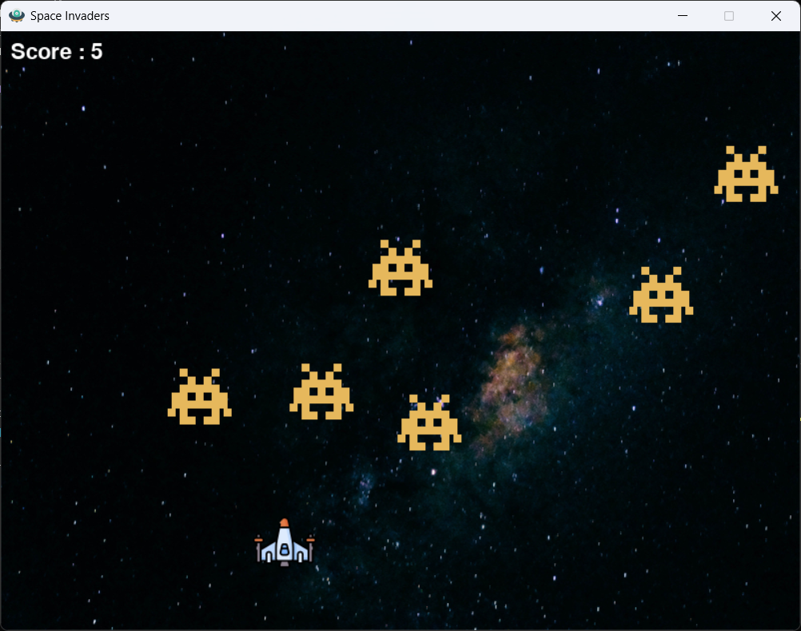

# 🚀 Space Invaders Game

A 2D arcade-style shooter inspired by the classic **Space Invaders**, built using Python and Pygame.

👉 **Download & Play:**
https://ayush-t05.itch.io/space-invaders

---

## 🎮 Gameplay

Control a spaceship, shoot incoming enemies, and survive as long as possible while increasing your score.

---

## 📸 Gameplay Preview



---

## 🔥 Features

* Player-controlled spaceship movement
* Shooting mechanics
* Enemy spawning system
* Collision detection
* Score tracking
* Fully playable downloadable version (itch.io)

---

## 🎯 Controls

* ⬅️ / ➡️ Arrow Keys — Move
* Spacebar — Shoot

---

## ▶️ How to Play

1. Visit the game page:
   https://ayush-t05.itch.io/space-invaders

2. Download the game

3. Run the executable file

4. Start playing 🎮

---

## 🛠️ Tech Stack

* Python
* Pygame

---

## 📂 Project Structure

```
space-invaders-game/
│
├── assets/        # Images and resources
├── main.py        # Game logic
├── README.md
```

---

## 📌 Future Improvements

* Sound effects and background music
* Increasing difficulty over time
* Power-ups (shield, rapid fire)
* Enemy shooting mechanics
* Improved UI and animations

---

## ⚠️ Honest Note

This project focuses on building core game development fundamentals such as game loops, collision detection, and real-time input handling.
Future versions will focus on adding more advanced gameplay features and polish.

---

## 💡 Key Learning

* Game loop implementation
* Event handling in real-time systems
* Object interaction and collision systems
* Structuring a playable game project

---

## 📬 Feedback

If you try the game, feel free to share suggestions or improvements.
